# 🌌 Yuhengs: Premium Anime Streaming Platform (Keqing Genshin Impact Theme) ✦

[](https://laravel.com/)
[](https://www.php.net/)
[](https://graphql.anilist.co)
[](https://github.com/DoniArmanS)

**Yuhengs** adalah platform web streaming anime premium ultra-modern yang dibangun di atas kerangka kerja **Laravel 11 (PHP 8.3)**. Nama "Yuhengs" dan estetika visual platform ini terinspirasi langsung dari **Keqing (Yuheng of the Liyue Qixing)** dari game Genshin Impact. 

Aplikasi ini menyajikan antarmuka premium *glassmorphic* yang interaktif lengkap dengan animasi kelopak bunga sakura berguguran (*falling sakura*) yang berkinerja tinggi, efek kilat listrik (*electro sparks*), dan perpaduan warna Keqing yang megah: **Rich Purple, Liyue Gold, dan Sakura Pink**.

---

## ⚡ Fitur Utama & Keunggulan

*   **Keamanan & Kecepatan Laravel**: Dibangun menggunakan core Laravel 11 untuk keamanan maksimum (proteksi XSS/CSRF terintegrasi) serta rendering cepat menggunakan Blade Template Engine.
*   **Arsitektur Multi-Server Anti-Lag**: Dilengkapi dengan sistem penyedia streaming *multi-mirror*. Platform akan mengambil mirror langsung dari scraper **Gogoanime** (seperti Gogo Play, Vidstreaming, Filemoon, Mp4Upload) serta backup premium dari **Embed.su** dan **VidLink** berbasis MAL ID. Jika salah satu server lambat atau lag, pengguna dapat berpindah server dalam 1 kali klik tanpa memuat ulang (*reload*) seluruh halaman.
*   **Integrasi AniList API (Tanpa Limit)**: Menggunakan AniList GraphQL API di server-side untuk pencarian real-time, statistik anime, cover kualitas tinggi, daftar tren, serta daftar populer secara instan dan tanpa batasan kunci API (*API Keys*).
*   **Aesthetic Keqing visual**: Desain bertema gelap bertabur bintang dengan partikel listrik Electro Keqing, kelopak bunga sakura falling berguguran menggunakan HTML5 Canvas, border aksen emas Liyue, dan favicon wajah Keqing chibi yang sangat imut.
*   **Responsif & Ringan**: Dioptimalkan secara penuh untuk kenyamanan streaming baik di perangkat seluler (smartphone), tablet, maupun PC desktop.

---

## 🛠️ Bagaimana Sistem Ini Bekerja?

Berikut adalah alur data dari pencarian hingga video diputar di dalam sistem **Yuhengs**:

```mermaid
graph TD
    %% User Search
    subgraph UI_Interaction [1. Antarmuka Pengguna & Pencarian]
        U1[Pengguna membuka Beranda Yuhengs] -->|Melihat Anime Tren & Populer| U2[Tampilan Dashboard Glassmorphic]
        U1 -->|Ketik Judul di Kolom Pencarian| S1[Kirim Query Pencarian ke Route]
    end

    %% Metadata Retrieval
    subgraph Metadata_API [2. Pengambilan Metadata / AniList]
        S1 -->|GraphQL HTTP Request| A1[AniList API Server]
        A1 -->|Kembalikan Detail Anime, Cover, Genre, MAL ID| A2[Controller Laravel]
    end

    %% Stream Resolving
    subgraph Streaming_Resolver [3. Pemecah Tautan Streaming / Resolver]
        A2 -->|Judul Anime| G1[GogoAnime Scraper Service]
        G1 -->|Cari Slug & Parse Episode Page| G2[Ambil Tautan data-video Server]
        G2 -->|Mirror: GogoPlay, Vidstreaming, Filemoon, Mp4| SRV[Daftar Server Mirror]
        
        A2 -->|MAL ID| F1[Fallback Premium Embeds: Embed.su & VidLink]
        F1 --> SRV
    end

    %% Video Rendering
    subgraph Rendering_Engine [4. Pemutaran Video]
        SRV -->|Render Pilihan Server di HTML| V1[Halaman Watch / Pemutar Video]
        V1 -->|Pengguna Klik Server Lain jika Lag| JS[Script Ganti src Iframe Dinamis via JS]
    end

    style UI_Interaction fill:#0b081c,stroke:#8b5cf6,stroke-width:2px;
    style Metadata_API fill:#0b081c,stroke:#ffd700,stroke-width:2px;
    style Streaming_Resolver fill:#05030e,stroke:#a855f7,stroke-width:2px;
    style Rendering_Engine fill:#0b081c,stroke:#ffb7c5,stroke-width:2px;
```



---

## 📂 Struktur Direktori Utama

```
Yuhengs/
├── app/
│   ├── Http/Controllers/
│   │   └── AnimeController.php   # Controller Utama (AniList API & Route logic)
│   └── Services/
│       └── GogoAnimeService.php  # Layanan Scraper Multi-Server Gogoanime
├── public/                       # Aset Publik (CSS, JS, Gambar Tema Keqing)
│   ├── css/
│   │   └── keqing-theme.css      # CSS Premium Bertema Keqing (Purple, Gold, Sakura)
│   ├── js/
│   │   └── anime-player.js       # Logika ganti server & Falling Sakura Canvas
│   └── images/
│       └── keqing-favicon.png    # Favicon wajah Keqing chibi
├── resources/
│   └── views/
│       ├── layouts/
│       │   └── app.blade.php     # Layout Master HTML tunggal
│       └── anime/
│           ├── index.blade.php   # Tampilan Beranda & Hasil Pencarian
│           └── watch.blade.php   # Tampilan Pemutar Video & Navigasi Episode
└── routes/
    └── web.php                   # Rute Aplikasi Web
```

---

## 🚀 Panduan Instalasi & Menjalankan secara Lokal

Ikuti petunjuk di bawah ini untuk menginstal proyek **Yuhengs** di komputer Anda atau server hosting mana pun secara mandiri tanpa dependensi path absolut:

### Prasyarat System
Pastikan komputer Anda telah terinstal:
*   **PHP 8.2 atau lebih tinggi**
*   **Composer** (Manajer Dependensi PHP)
*   **Node.js & NPM** (untuk kompilasi aset jika diperlukan)

---

### Langkah 1: Clone Repositori
Clone proyek ini dari GitHub ke dalam folder komputer Anda:
```bash
git clone https://github.com/DoniArmanS/Yuhengs.git
cd Yuhengs
```

### Langkah 2: Instalasi Dependensi PHP (Laravel Core)
Jalankan perintah Composer berikut untuk menginstal semua library PHP yang diperlukan Laravel:
```bash
composer install
```

### Langkah 3: Setup File Lingkungan (.env)
Salin file konfigurasi contoh `.env.example` menjadi `.env` yang sesungguhnya:
```bash
cp .env.example .env
```

### Langkah 4: Generate Application Key
Generate kunci enkripsi keamanan unik untuk aplikasi Anda:
```bash
php artisan key:generate
```

### Langkah 5: Migrasi Database (Opsional)
Aplikasi Yuhengs menggunakan server-side caching dan scraping dinamis secara langsung tanpa membutuhkan tabel database khusus untuk anime. Namun, Anda tetap dapat membuat SQLite database bawaan Laravel dengan menjalankan:
```bash
# Buat file database kosong (jika belum ada)
touch database/database.sqlite

# Jalankan migrasi default
php artisan migrate
```

### Langkah 6: Jalankan Server Lokal
Nyalakan server pengembangan lokal Laravel Anda:
```bash
php artisan serve
```

Server Anda akan aktif di alamat berikut:
👉 [**http://127.0.0.1:8000**](http://127.0.0.1:8000)

Buka tautan di atas menggunakan peramban (browser) favorit Anda dan rasakan sensasi streaming anime premium bersama Keqing! ⚡

---

## 💜 Berikan Bintang!
Jika Anda menyukai proyek streaming anime bertemakan Keqing ini, silakan berikan bintang ⭐ di repositori GitHub [DoniArmanS/Yuhengs](https://github.com/DoniArmanS/Yuhengs)!
